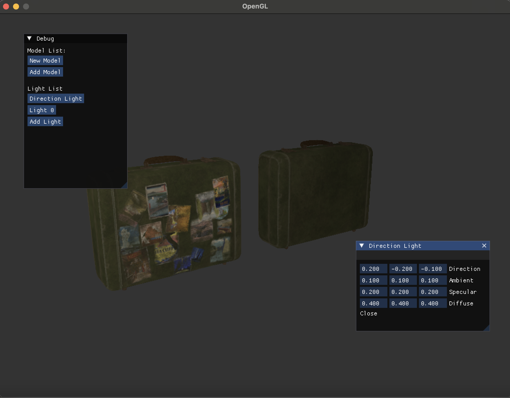

<h2 align = center>Caleb's Renderer<h2>

**Caleb's Renderer** is a rendering engine built in C++ using SDL2 and OpenGL.
It allows for model importing via Assimp. All model and lighting information is
editable in real time via ImGui windows.

<h3 align = center>Build Directions</h3>
Currently only this build has been tested for MacOS. To build, run..

    cmake --build {path-to-cmake-build-debug} --target all -j 6

in terminal. 

<h3 align = center>Usage</h3>
You can load in most external 3D models (all models supported by assimp) 
as long as they are in the working directory specified at compile time. Textures
must be provided. Shaders also need to be in a folder called shaders in the working 
directory. You load models by pushing the "Add Model" button in the ImGui 
window. You edit individual model's properties by pressing on the name of the loaded 
model. The same process applies for new lights.
